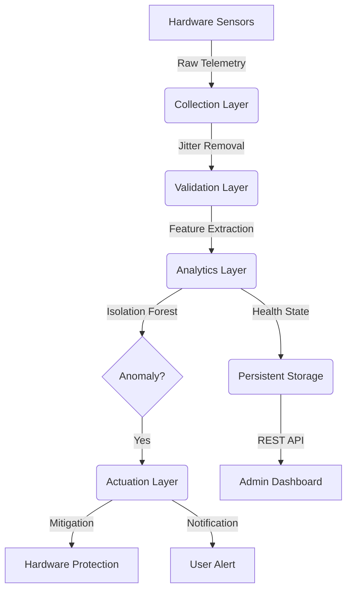

# Temperature Spikes Detection in Workstations

## 🌟 Project Overview
**Temperature Spikes Detection in Workstations** is a modular, production-grade **Cyber-Physical System (CPS)** designed for workstation health monitoring. It utilizes unsupervised machine learning (Isolation Forest) to detect thermal spikes and abnormal system behavior in real-time, providing proactive hardware protection through automated mitigation.

### 🔗 Project Source
You can find the project repository here:
[https://github.com/Silvio777-hub/Temperature-Spikes-Detection-in-Workstations](https://github.com/Silvio777-hub/Temperature-Spikes-Detection-in-Workstations)

---

## 🏗️ System Architecture
The system follows a robust 4-layer CPS architecture to ensure high fidelity and reliable actuation.



1.  **Collection Layer**: Gathers hardware telemetry (CPU/GPU Temp, Fan Speed, Power, Disk I/O).
2.  **Validation Layer**: Performs data cleaning, noisy sensor filtering, and fallback logic.
3.  **Analytics Layer**: ML-based anomaly detection and 4-state health classification (NORMAL, ALERT, CRITICAL, STABLE).
4.  **Actuation Layer**: Executes automated mitigation (process termination) and desktop alerting.

---

## 🛠️ Technologies Used
The project is built using a modern Python-based stack:
- **Core Logic**: Python 3.8+
- **Machine Learning**: Scikit-Learn (Isolation Forest), NumPy, Pandas
- **System Monitoring**: `psutil`, `wmi`, `py3nvml` (NVIDIA GPU support)
- **UI & Visualization**: `rich` (Terminal Dashboard), `matplotlib` (Analytics)
- **Networking/API**: `FastAPI`, `Uvicorn`
- **Utility**: `plyer` (Desktop Notifications), `pywin32` (Windows Integration), `PyYAML`

---

## 💻 Setup & Installation Guide

### Prerequisites
- **OS**: Windows (preferred for full WMI/Sensor support) or Linux.
- **Python**: 3.8 or higher.
- **Privileges**: Administrator/Sudo rights are required for hardware sensor access.

### Step-by-Step Setup
1.  **Clone the Project**:
    ```bash
    git clone https://github.com/Silvio777-hub/Temperature-Spikes-Detection-in-Workstations.git
    cd Temperature-Spikes-Detection-in-Workstations
    ```

2.  **Automated Setup (Windows)**:
    Run the provided setup script to create directories and install dependencies:
    ```cmd
    setup.bat
    ```

3.  **Manual Setup**:
    If you prefer manual configuration:
    ```bash
    mkdir Data\raw Data\validated Data\processed Models Logs Reports
    pip install -r requirements.txt
    ```

---

## 🚀 Execution Guideline (From Setup to Achievement)

To achieve full system functionality, follow these four phases:

### Phase 1: Baseline Data Collection (PC1)
*   **Goal**: Establish what "Normal" looks like for your specific hardware.
*   **Action**: Run the monitor for 10-15 minutes during regular activity (web browsing, typing).
*   **Command**: `python -m Code.main monitor`
*   **Output**: Data is logged to `Logs/system_events.csv`.

### Phase 2: Model Training
*   **Goal**: Train the Isolation Forest model on your baseline data.
*   **Action**: Use the collected log to generate the ML model.
*   **Command**: `python -m Code.main train --input Logs/system_events.csv`
*   **Output**: Trained models saved in the `Models/` directory.

### Phase 3: Real-Time Deployment (PC2)
*   **Goal**: Deploy the system to monitor for spikes using the trained model.
*   **Action**: Start the detector with ML enabled.
*   **Command**: `python -m Code.main monitor --ml` (or use `run_detector.bat`)

# ### Phase 4: Achievement - Stress Testing & Mitigation
*   **Goal**: Verify that the system detects a spike and protects the hardware.
*   **Action**: Run a stress test. You can use the bundled `src/stress_test.py` script (Python) **or** any of the following third‑party utilities:
    - **Prime95** (CPU stress, Small FFTs)
    - **AIDA64** (CPU, GPU, memory, and thermal benchmarking)
    - **OCCT** (CPU & GPU load, also provides fan curve control)
    - **IntelBurnTest** (maximum CPU power draw)
    - **FurMark** (GPU intensive rendering)
    - **Blender** (CPU/GPU rendering benchmark)
    - **stress‑ng** (Linux, but works via WSL for cross‑platform tests)
*   **Command (Python script)**: `python -m src.stress_test --duration 120 --cpu 4 --gpu 1`
*   **Result**:
    1.  The dashboard will transition from **GREEN (NORMAL)** to **RED (CRITICAL)**.
    2.  A desktop notification will appear.
    3.  The system will identify the stress‑test process and **terminate it automatically**.
    4.  The system enters **CYAN (STABLE)** state as temperatures drop.

---

## 📡 Remote Monitoring API
Monitor your workstation health from across the network.
- **Start API**: `python -m Code.main api`
- **Endpoint**: `http://localhost:8000/health`
- **Security**: Requires Header `X-API-KEY: CPS_SECURE_TOKEN_2026`.

---
## 📊 Documentation & Reports
For deep technical details, refer to:
- [Final Project Report](docs/Final_Report.md)
- [User & Developer Guide](docs/User_Guide.md)
- [Video Presentation Script](docs/VidScript.md)

---
## 📹 Video Recording Guide
To capture high‑quality video of the demo you can use any of the following free tools:

- **OBS Studio** – Open‑Source, cross‑platform screen recorder. https://obsproject.com/
- **ShareX** – Windows screen capture tool with video support. https://getsharex.com/
- **Xbox Game Bar** – Built‑in on Windows 10/11 (Win+G).
- **ffmpeg** – Command‑line recorder (already used by the provided script).

### Recording with the bundled script
A small helper script `src/record_screen.py` wraps `ffmpeg` to record the entire screen (or a region) for a specified duration.

```bash
python -m src.record_screen --duration 180 --output demo.mp4
```

The script automatically checks that `ffmpeg` is in your `PATH` and falls back to a friendly error message if it is missing.

#### Installing ffmpeg
- **Windows**: download the static build from https://ffmpeg.org/download.html, unzip, and add the `bin` folder to your system `PATH`.
- **Linux/macOS**: `sudo apt-get install ffmpeg` or `brew install ffmpeg`.

Combine the recorder with the stress script, e.g.:

```bash
python -m src.record_screen --duration 180 --output demo.mp4 &
python -m src.stress_test --duration 180 --cpu 4 --gpu 1
```

This will start recording, run the stress test, and stop recording once the test completes.

---
## 📋 Suggested Additions

- **Known Issues & Mitigations**

  | Warning Message | Cause | Recommended Fix |
  |-----------------|-------|-----------------|
  | `UserWarning: X does not have valid feature names` | Scaler receives dict without column names | Wrap feature dict in `pd.DataFrame` with proper column names (see `src/detection/ml_engine.py`); ensure feature dict keys match training columns. |
  | `UserWarning: Converting sparse ...` | Deprecated sklearn behavior | Update scikit‑learn to latest version or suppress with `warnings.filterwarnings`. |
  | `RuntimeWarning: overflow encountered in exp` | Numerical overflow in custom calculations | Clip input values or use `numpy.seterr` to handle overflow. |

- **Contributor**

  | Name | Role | Contact |
  |------|------|---------|
  | Opoka JM Silvio | Lead Researcher & Developer | [opoka2010@gmail.com]|


- **Installation via pip**

  ```bash
  pip install temperature-spikes-detection
  ```

- **Docker Support**

  1. Build the image: `docker build -t temp-spike .`
  2. Run the container: `docker compose up` (ensure `docker-compose.yml` is present)

- **CI/CD Badges**

  

- **Citation**

  ```bibtex
  @misc{temperature-spikes-2026,
    author = {Opoka JM Silvio},
    title = {Temperature Spikes Detection in Workstations},
    year = {May 14, 2026},
    url = {https://github.com/Silvio777-hub/Temperature-Spikes-Detection-in-Workstations},
    
}
  ```
---
© 2026 Temperature Spikes Detection Project. Built for CPS Excellence.
