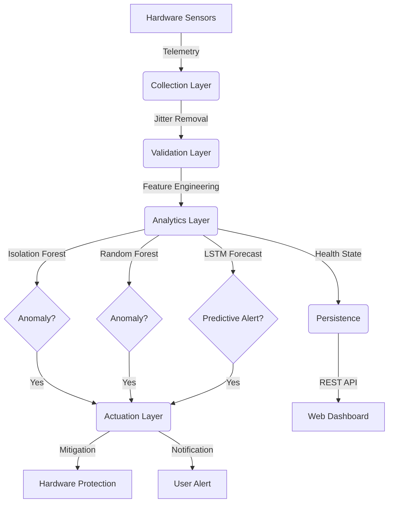

# Temperature Spikes Detection in Workstations

## 🌟 Project Overview
**Temperature Spikes Detection in Workstations** is a modular, production-grade **Cyber-Physical System (CPS)** designed for workstation health monitoring. It utilizes a multi-model ensemble—Unsupervised (Isolation Forest), Supervised (Random Forest), and Deep Learning (LSTM)—to detect and forecast thermal spikes, ensuring proactive hardware protection.

### 🔗 Project Source
You can find the project repository here:
[https://github.com/Silvio777-hub/Temperature-Spikes-Detection-in-Workstations](https://github.com/Silvio777-hub/Temperature-Spikes-Detection-in-Workstations)

---

## 🏗️ System Architecture
The system follows a robust 4-layer CPS architecture to ensure high fidelity and reliable actuation.



1.  **Collection Layer**: Gathers hardware telemetry (CPU/GPU Temp, Fan Speed, Power, Disk I/O).
2.  **Validation Layer**: Performs data cleaning, noisy sensor filtering, and fallback logic.
3.  **Analytics Layer**: Multi-model intelligence including Anomaly detection (Isolation Forest), Classification (Random Forest), and Time-Series Forecasting (LSTM).
4.  **Actuation Layer**: Executes automated mitigation (process termination) and desktop alerting.

---

## 🛠️ Technologies Used
The project is built using a modern Python-based stack:
- **Core Logic**: Python 3.10+
- **Machine Learning**: Scikit-Learn (Isolation Forest, Random Forest), NumPy, Pandas
- **Deep Learning**: TensorFlow (LSTM Time-Series Forecasting)
- **System Monitoring**: `psutil`, `wmi`, `py3nvml` (NVIDIA), **OpenHardwareMonitor** (iGPU/AMD Support)
- **UI & Visualization**: `rich` (Premium Terminal Dashboard), `seaborn`, `matplotlib`
- **Networking/API**: `FastAPI`, `Uvicorn`
- **Utility**: `plyer` (Notifications), `pywin32`, `PyYAML`, `Jinja2`

---

## 🚀 Highlights & Pro Features
- **Ensemble Intelligence**: Combines Isolation Forest (Unsupervised) and Random Forest (Supervised) for robust anomaly classification.
- **LSTM Forecasting**: Deep Learning layer predicts future temperatures, enabling proactive cooling alerts.
- **Adaptive Throttling**: Implements "Soft Mitigation" by reducing process priority before "Hard Mitigation" (termination).
- **Forensic Snapshots**: Automatically captures high-resolution JSON state snapshots during anomalies for auditing.
- **Thermal Inertia Engine**: Pre-emptive alerting based on temperature "Rate of Rise" detection.
- **Premium Dashboard**: Professional ASCII-branded dashboard with real-time color-coded telemetry.
- **Intelligent Fallbacks**: Automatically detects Integrated Graphics (iGPU) and estimates Fan Speed on Windows systems where sensors are locked.
- **Multi-Node Aggregator**: Monitor a cluster of workstations from a single health "Heat Map".
- **Dynamic Throttling Detection**: High-fidelity detection that differentiates between idle power-saving and actual thermal throttling.
- **Robust Encoding Engine**: Auto-resilient parsing and writing (supporting UTF-8, UTF-8-sig, CP1252, and Latin-1) to seamlessly handle non-ASCII symbols like degree (`°`) across varying OS locales without crash failures.

---

## 💻 Setup & Installation Guide

### Prerequisites
- **OS**: Windows (preferred for full WMI/Sensor support) or Linux.
- **Python**: 3.8 or higher.
- **Privileges**: Administrator/Sudo rights are required for hardware sensor access.

### Step-by-Step Setup
1.  **Clone the Project**:
    ```bash
    git clone https://github.com/Silvio777-hub/Temperature-Spikes-Detection-in-Workstations.git
    cd Temperature-Spikes-Detection-in-Workstations
    ```

2.  **Automated Setup (Windows)**:
    Run the provided setup script to create directories and install dependencies:
    ```cmd
    setup.bat
    ```

### 🖥️ Hardware Sensor Setup (Windows)
To unlock full GPU and Fan monitoring on Windows 11:
1.  Download [OpenHardwareMonitor](https://openhardwaremonitor.org/).
2.  Launch the app and select **"Run as Administrator"**.
3.  Ensure "WMI Support" is enabled in the app settings.
4.  Keep it running in the tray; the system will automatically hook into it.

---

## 🚀 Execution Guideline (From Setup to Achievement)

To achieve full system functionality, follow these four phases:

### Phase 1: Baseline Data Collection (PC1)
*   **Goal**: Establish what "Normal" looks like for your specific hardware.
*   **Action**: Run the monitor for 10-15 minutes during regular activity.
*   **Command**: `python -m thermal_system.main monitor`
*   **Output**: Data is logged to `Logs/system_events.csv`.

### Phase 2: Model Training
*   **Goal**: Train the Isolation Forest model on your baseline data.
*   **Action**: Use the collected log to generate the ML model.
*   **Command**: `python -m thermal_system.main train --input Logs/system_events.csv`
*   **Output**: Trained models saved in the `Models/` directory.

### Phase 3: Real-Time Deployment (PC2)
*   **Goal**: Deploy the system to monitor for spikes using the trained model.
*   **Action**: Start the detector with ML enabled.
*   **Command**: `python -m thermal_system.main monitor --ml` (or use `run_detector.bat`)

# Phase 4: Achievement - Stress Testing & Mitigation
*   **Goal**: Verify that the system detects a spike and protects the hardware.
*   **Action**: Run a stress test. You can use the bundled `thermal_system.utils.stress_test` script (Python) **or** any of the following third‑party utilities:
    - **Prime95** (CPU stress, Small FFTs)
    - **AIDA64** (CPU, GPU, memory, and thermal benchmarking)
    - **OCCT** (CPU & GPU load, also provides fan curve control)
    - **IntelBurnTest** (maximum CPU power draw)
    - **FurMark** (GPU intensive rendering)
    - **Blender** (CPU/GPU rendering benchmark)
    - **stress‑ng** (Linux, but works via WSL for cross‑platform tests)
*   **Command (Python script)**: `python -m thermal_system.utils.stress_test --duration 120 --cpu 4 --gpu 1`
*   **Result**:
    1.  The dashboard will transition from **GREEN (NORMAL)** to **RED (CRITICAL)**.
    2.  A desktop notification will appear.
    3.  The system will identify the stress‑test process and **terminate it automatically**.
    4.  The system enters **CYAN (STABLE)** state as temperatures drop.

### Recommended Stress Testing Utilities
To effectively test the system on **PC2**, you can use the bundled `thermal_system.utils.stress_test` or these professional tools:
- **Prime95**: Best for extreme CPU heat (Small FFTs).
- **AIDA64**: Comprehensive system stability benchmark.
- **OCCT**: Features built-in thermal safety monitoring.
- **IntelBurnTest**: Extremely high-stress Linpack-based test.
- **FurMark**: The standard for GPU thermal stress.
- **Cinebench**: Realistic heavy rendering workload.

### Phase 5: Automated Forensic Diagnostics & Health Analytics
*   **Goal**: Generate professional summary reports, statistics, correlation heatmaps, and visual charts of workstation health.
*   **Action**: Execute the diagnostic CLI tool on the recorded system events CSV.
*   **Command**: `python -m thermal_system.main diagnose --input Logs/system_events.csv`
*   **Output**: High-fidelity reports and figures saved inside the `Reports/` directory:
    - `health_states_pie.png`: Pie chart representing active state distributions (Normal, Alert, Critical, etc.).
    - `thermal_trends_detailed.png`: Comprehensive trend plotting showing temperature correlation with CPU load.
    - `metric_correlation.png`: Correlation matrix heatmap showcasing how metrics (RAM, Fan speed, Temp, Load) influence each other.
    - `statistical_summary.csv`: Fully aggregated numerical metrics breakdown (mean, standard deviation, max/min limits).

---

## 📡 Remote Monitoring API
Monitor your workstation health from across the network.
- **Start API**: `python -m thermal_system.main api`
- **Endpoint**: `http://localhost:8000/health`
- **Security**: Requires Header `X-API-KEY: CPS_SECURE_TOKEN_2026`.

---
## 📊 Documentation & Reports
For deep technical details, refer to:
- [Final Project Report](Final_Project_Report.md)
- [Video Presentation Script](Final_Video_Script.md)
- [Statistical Summary](Reports/statistical_summary.csv)

---
## 📹 Video Recording Guide
To capture high‑quality video of the demo you can use any of the following free tools:

- **OBS Studio** – Open‑Source, cross‑platform screen recorder. https://obsproject.com/
- **ShareX** – Windows screen capture tool with video support. https://getsharex.com/
- **Xbox Game Bar** – Built‑in on Windows 10/11 (Win+G).
- **ffmpeg** – Command‑line recorder (already used by the provided script).

### Recording with the bundled script
A small helper script `app.utils.record_screen` wraps `ffmpeg` to record the entire screen (or a region) for a specified duration.

```bash
python -m thermal_system.utils.record_screen --duration 180 --output demo.mp4
```

The script automatically checks that `ffmpeg` is in your `PATH` and falls back to a friendly error message if it is missing.

#### Installing ffmpeg
- **Windows**: download the static build from https://ffmpeg.org/download.html, unzip, and add the `bin` folder to your system `PATH`.
- **Linux/macOS**: `sudo apt-get install ffmpeg` or `brew install ffmpeg`.

Combine the recorder with the stress script, e.g.:

```bash
python -m thermal_system.utils.record_screen --duration 180 --output demo.mp4 &
python -m thermal_system.utils.stress_test --duration 180 --cpu 4 --gpu 1
```

This will start recording, run the stress test, and stop recording once the test completes.

---
## 📋 Suggested Additions

- **Known Issues & Mitigations**

  | Warning Message | Cause | Recommended Fix |
  |-----------------|-------|-----------------|
  | `UserWarning: X does not have valid feature names` | Scaler receives dict without column names | Wrap feature dict in `pd.DataFrame` with proper column names (see `src/detection/ml_engine.py`); ensure feature dict keys match training columns. |
  | `UserWarning: Converting sparse ...` | Deprecated sklearn behavior | Update scikit‑learn to latest version or suppress with `warnings.filterwarnings`. |
  | `RuntimeWarning: overflow encountered in exp` | Numerical overflow in custom calculations | Clip input values or use `numpy.seterr` to handle overflow. |

- **Contributor**

  | Name | Role | Contact |
  |------|------|---------|
  | Opoka JM Silvio | Lead Researcher & Developer | [opoka2010@gmail.com]|


- **Installation (Local Developer Mode)**

  ```bash
  # Clone the repository
  git clone https://github.com/Silvio777-hub/Temperature-Spikes-Detection-in-Workstations
  cd "Temperature Spikes Detection in Workstations"

  # Install in editable mode
  pip install -e .
  ```

- **Docker & Scalability**

  1. Build and start both the Monitor and the API Dashboard:
     ```bash
     docker compose up --build
     ```
  2. Access the dashboard at `http://localhost:8000`.

- **CI/CD Status**

  

- **Citation**

  ```bibtex
  @misc{temperature-spikes-2026,
    author = {Opoka JM Silvio},
    title = {Temperature Spikes Detection in Workstations},
    year = {May 14, 2026},
    url = {https://github.com/Silvio777-hub/Temperature-Spikes-Detection-in-Workstations},
    
}
  ```
---
© 2026 Temperature Spikes Detection in Workstations. Built for CPS Excellence.
